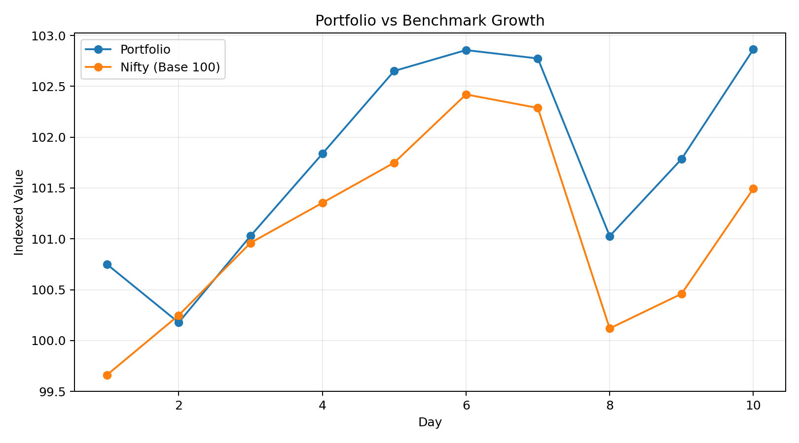
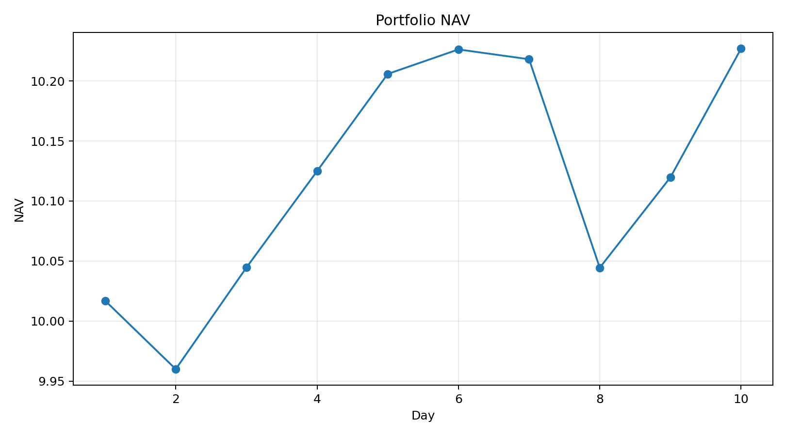
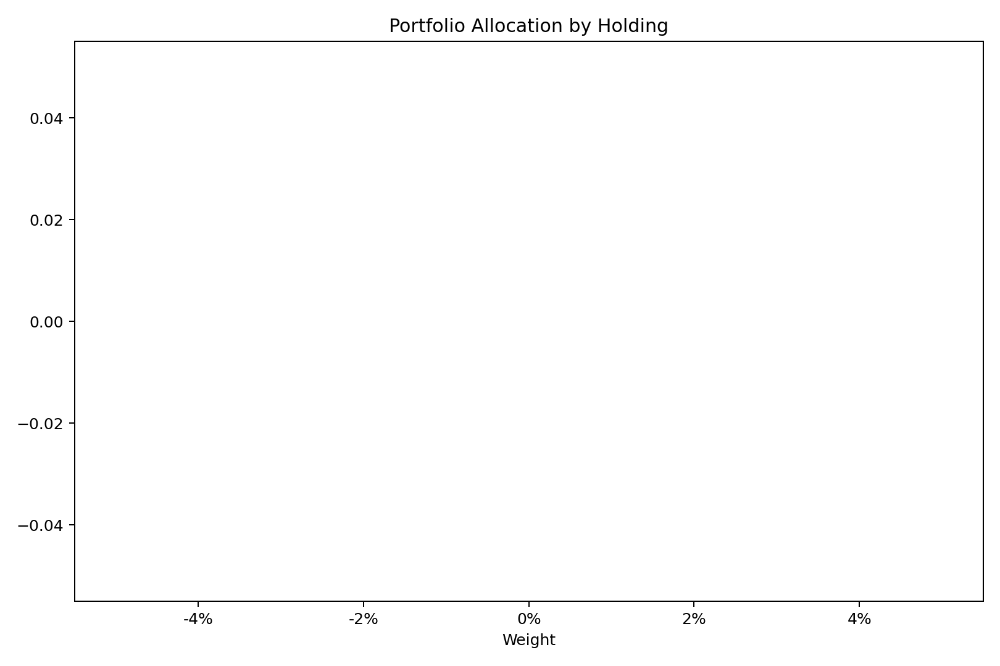
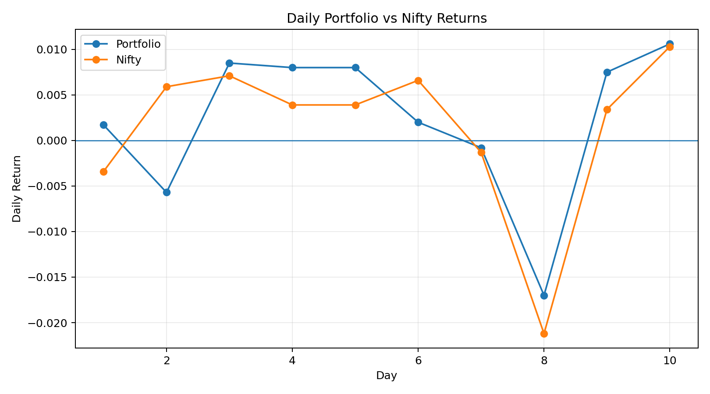

# Portfolio Management — Portfolio vs Nifty Benchmark

A portfolio-management and performance-analysis project using a simulated ₹100.58 Cr equity portfolio and a Nifty benchmark. The project demonstrates portfolio construction, NAV tracking, benchmark comparison and statistical risk measurement.

## Key Outputs

- Portfolio capital: ₹100.58 Cr
- Observation period: 1–10 July 2026
- Portfolio cumulative return: 2.10%
- Benchmark cumulative return: 1.84%
- Relative performance: 0.26%
- Statistical beta: 0.779

> The available dataset contains only 10 daily observations. Performance and annualized risk metrics should therefore be interpreted as illustrative rather than as a long-term track record.

## Files

- [Excel Portfolio Model](MODEL/Portfolio_Management_Model.xlsx)
- [Portfolio Analysis Report](DOCS/Portfolio_Management_Report.pdf)
- [Methodology](DOCS/METHODOLOGY.md)
- [Assumptions & Limitations](DOCS/ASSUMPTIONS_AND_LIMITATIONS.md)
- [Model Checks](DOCS/MODEL_CHECKS.md)
- [Performance Summary](DOCS/PERFORMANCE_SUMMARY.md)

## Visuals

## Methodological Correction

The original workbook included a column labelled Beta calculated as stock 3-year CAGR divided by benchmark CAGR. That ratio is not statistical beta. The corrected analysis calculates beta from covariance of portfolio and benchmark daily returns divided by benchmark return variance. The original ₹100 Cr starting value is also replaced in the corrected analysis by the actual holdings total of ₹100.58 Cr.

## Disclaimer

This is an educational and portfolio-management modelling project. It is not investment advice and does not represent a live managed portfolio.
